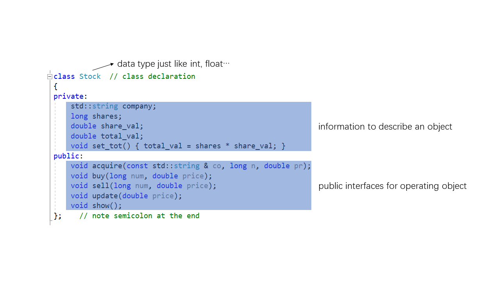
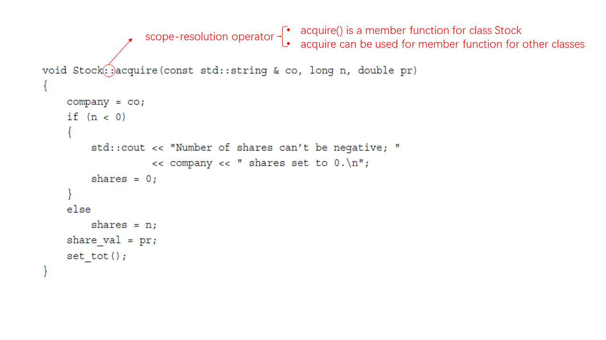
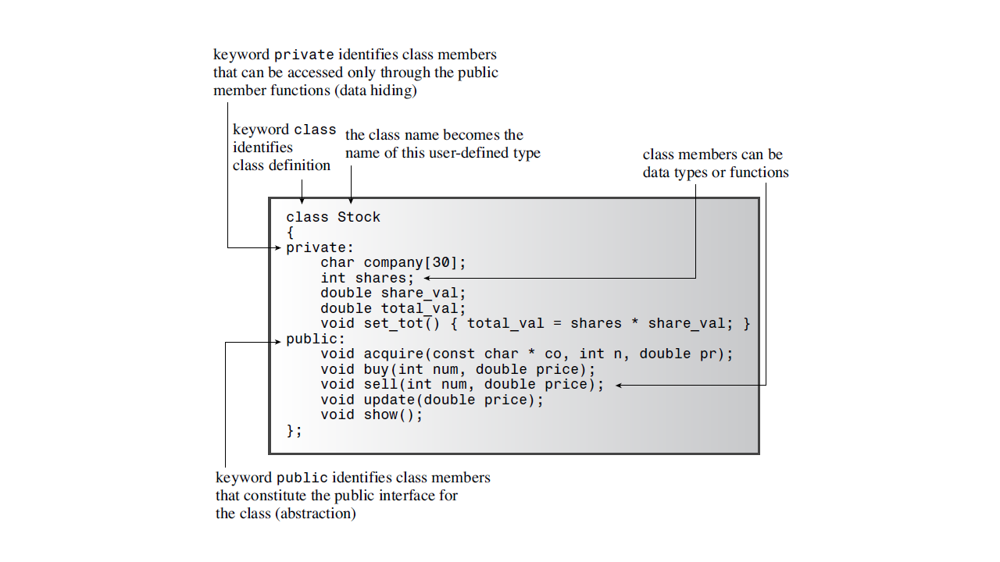
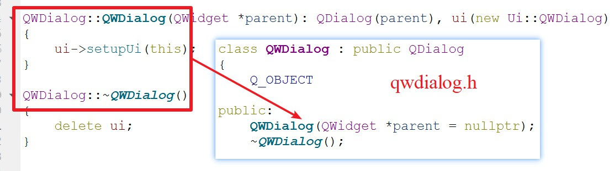
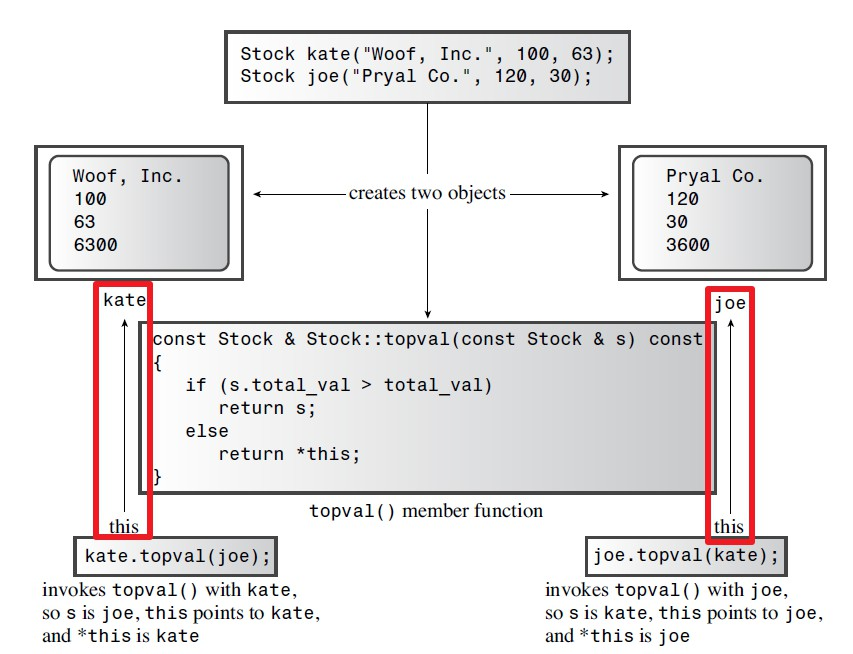
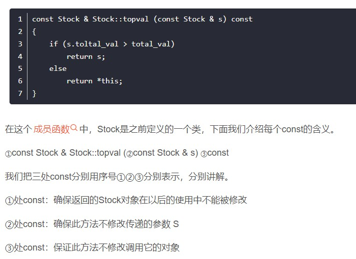

# C++学习笔记
## 类
### 如何创建一个类
创建一个类包含两个部分
- 类声明
下面的类声明通常写在`.h`文件里。
```C++
class className
{
private:
data member declarations
public:
member function prototypes
};
```
public部分为一些函数接口、方法，可由对象调用来访问private部分的数据。
private部分为一些描述对象特征的数据。当然也可以抽象封装一些函数。
下图为一个实例：


- 类中的成员函数定义
除一些特别简单的成员函数在其声明时定义，通常情况下多数函数定义在`.cpp`文件中实现。需要使用到scope-resolution operator(::)指明了成员函数归属的类



### 类的权限控制（Access Control）

- private部分只可以通过public部分的成员函数访问
- private部分的目的包括通过控制权限**保证数据完整性**
- 通过权限控制使得class的使用者可以不关心数据是如何表示的，只需要知道成员函数传入的参数以及返回值，这使得语言变得**好用**。另一方面是对于函数有更好的实现方式时，函数的接口不需要更改，只要修改函数的实现部分，只使得函数**便于维护**。

### 构造函数和析构函数
*目的：*
C++创建构造函数和析构函数的目的是使用类对象时如同使用其他内部类型（如：int、char）一样，具体来说就是其他类型初始化时可以赋值值，但由于类的成员多存储在private部分，初始化是无法访问这部分的，因而引入构造函数。
The job of a constructor is to initialize the data members of a class object.

- 为什么对象创建的时候需要初始化？
理由是对象使用过程中并不知道成员及成员函数的使用顺序，最后的办法就是创建成员的时候就将其初始化。

不要将构造函数参数名与类成员名取成相同的，这样会导致在构造函数中赋值时发现同一个名字的参数值赋给了同一个名字的类成员变量。
*介绍两种方法来命名类的成员变量：*
- 方法1：加m_作为前缀，表明是成员变量。（例如：m_price）
- 方法2：加_作为后缀，表明是成员变量。（例如：price_)
这样就可以在构造函数中按下面这种方式使用:
`m_price = price;`


构造函数显式初始化the constructor explicitly:
`Stock garment = Stock("Furry Mason", 50, 2.5));`

构造函数隐式初始化the constructor implicitly:
`Stock garment("Furry Mason", 50, 2.5);`

`Stock *pstock = new Stock("Electroshock Games", 18, 19.0);`
This statement creates a Stock object, initializes it to the values provided by the arguments, and assigns the address of the object to the pstock pointer. In this case, the object doesn’t have a name, but you can use the pointer to manage the object.

构造函数并不是类中的一个普通的成员函数。普通成员函数可由对象调用，但构造函数创建对象
You can’t use an object to invoke a constructor because until the constructor finishes its work of making the object, there is no object. Rather than being invoked by an object, the constructor is used to create the object.

#### 默认构造函数Default Constructors


*遗留问题：*


*参考：*
*C++ primer plus*, Stephen Prata, Sixth Edition. Page 524
*C++ Primer*, Stanley B. Lippman, Josée Lajoie, Barbara E. Moo, Fifth Edition.


Class Constructors and Destructors


- 构造函数和析构函数在编译器编译过程中就已经创建，在释放前会自动调用析构函数。
- 构造函数与析构函数的执行顺序
     - 对于有多个构造函数的类

```C++
class Person {
public:
	//无参（默认）构造函数
	Person() {
		cout << "无参构造函数!" << endl;
	}
	//有参构造函数
	Person(int a) {
		age = a;
		cout << "有参构造函数!" << endl;
	}
	//拷贝构造函数
	Person(const Person& p) {
		age = p.age;
		cout << "拷贝构造函数!" << endl;
	}
	//析构函数
	~Person() {
		cout << "析构函数!" << endl;
	}
public:
	int age;
};
```
     - 当一个函数中，使用该类创建了多个对象时，需要所有对象执行完构造函数后才调用析构函数
```C++
void test02() {

	//2.1  括号法，常用
	Person p1(10);
	//注意1：调用无参构造函数不能加括号，如果加了编译器认为这是一个函数声明
	//Person p2();

	//2.2 显式法
	Person p2 = Person(10);
	Person p3 = Person(p2);
	//Person(10)单独写就是匿名对象  当前行结束之后，马上析构

	//2.3 隐式转换法
	Person p4 = 10; // Person p4 = Person(10); 
	Person p5 = p4; // Person p5 = Person(p4); 

	//注意2：不能利用 拷贝构造函数 初始化匿名对象 编译器认为是对象声明
	//Person p5(p4);
}
 ```
     
     构造函数将被调用，并且在被同一个函数调用结束后，才会按顺序依次调用析构函数。

- Date hiding is a good practice in computing because it preserves the integrity of the data.

### Constructor Initializer List




https://blog.csdn.net/zx3517288/article/details/48806785


### Knowing Your Objects: The `this` Pointer 
- WHAT：什么是`this`指针？
`this`指针是指向调用成员函数的对象的指针

     - 若kate调用topval()，this指向kate
     - 若joe调用topval()，this指向joe

- WHY:为什么需要`this`指针？
当利用一个类创建了多个对象时，且多个对象之间需要相互调用。此时作为参数被传入的对象拥有形参名，称为被显式地访问，另一个调用方法的对象被称为隐式的访问。对于这个调用方法的对象在方法内部实现过程中没有名字，通过`this`来指向。实际上，`this`被作为隐藏参数传递给了方法。
- HOW:如何使用`this`指针？
在


```C++
#include <iostream>
using namespace std;
#include <string>

class Stock
{
private:
	std::string company;
	int shares;
	double share_val;
	double total_val;
	void set_tot() { total_val = shares * share_val; }
public:
	Stock(); // default constructor
	Stock(const std::string & co, long n = 0, double pr = 0.0);
	~Stock(); // do-nothing destructor
	void buy(long num, double price);
	void sell(long num, double price);
	void update(double price);
	void show()const;
	const Stock & topval(const Stock & s) const;
};

// constructors
Stock::Stock()        // default constructor
{
	shares = 0;
	share_val = 0.0;
	total_val = 0.0;
}

Stock::Stock(const std::string & co, long n, double pr)
{
	company = co;
	if (n < 0)
	{
		std::cout << "Number of shares can't be negative; "
			<< company << " shares set to 0.\n";
		shares = 0;
	}
	else
		shares = n;
	share_val = pr;
	set_tot();
}

// class destructor
Stock::~Stock()        // quiet class destructor
{
}


// other methods
void Stock::buy(long num, double price)
{
	if (num < 0)
	{
		std::cout << "Number of shares purchased can't be negative. "
			<< "Transaction is aborted.\n";
	}
	else
	{
		shares += num;
		share_val = price;
		set_tot();
	}
}

void Stock::sell(long num, double price)
{
	using std::cout;
	if (num < 0)
	{
		cout << "Number of shares sold can't be negative. "
			<< "Transaction is aborted.\n";
	}
	else if (num > shares)
	{
		cout << "You can't sell more than you have! "
			<< "Transaction is aborted.\n";
	}
	else
	{
		shares -= num;
		share_val = price;
		set_tot();
	}
}

void Stock::update(double price)
{
	share_val = price;
	set_tot();
}

void Stock::show() const
{
	using std::cout;
	using std::ios_base;
	// set format to #.###
	ios_base::fmtflags orig =
		cout.setf(ios_base::fixed, ios_base::floatfield);
	std::streamsize prec = cout.precision(3);

	cout << "Company: " << company
		<< "  Shares: " << shares << '\n';
	cout << "  Share Price: $" << share_val;
	// set format to #.##
	cout.precision(2);
	cout << "  Total Worth: $" << total_val << '\n';

	// restore original format
	cout.setf(orig, ios_base::floatfield);
	cout.precision(prec);
}

const Stock & Stock::topval(const Stock & s) const
{
	if (s.total_val > total_val)
		return s;
	else
		return *this;
}

int main() {

	Stock kate("Woof, Inc.", 100, 63);
	Stock joe("Pryal Co.", 120, 30);
	kate.topval(joe).show();

	system("pause");

	return 0;
}

```

- 三个const的含义



常见错误：
- 不能在成员函数的类外部重新声明该函数
在成员函数的类外部是可以定义成员函数的，前提是该成员函数在类中已经被声明过了。因而这个错误类型往往有两种可能。
     - 在成员函数类外定义成员函数时()后加入了分号
     - 在main()函数中定义成员函数


## 名称空间(namespace)
C++中的名称包括变量、函数、结构、类等等。不同厂商的类库可能取了相同的名字，为了防止调用过程中产生冲突，利用名称空间来控制名称的作用域。

**Terms:**
- 声明区域（declaration region）: A declarative region is a region
in which declarations can be made.
- 潜在作用域（potential scope）：The potential scope for a variable
begins at its point of declaration and extends to the end of its declarative region.
- 作用域（scope）: The portion of the program that can actually see the variable is termed the scope.

### 名称空间的使用
- using Declarations
```C++
using Jill::fetch;
```
A using declaration, then, makes a single name available.

- using Dirctives
```C++
using namespace Jill;
```
This makes all the names in the namespace available.

### using Declarations VS using Dirctives
- Generally speaking, the using declaration is safer to use than a using directive because it shows exactly what names you are making available. And if the name conflicts with a local name, the compiler lets you know.
- 

## REFERENCES
- *C++ primer plus*, Stephen Prata, Sixth Edition.
- *Programming: Principles and Practice Using C++*, Bjarne Storoustrup, Second Edition.
- *C++ Primer*, Stanley B. Lippman, Josée Lajoie, Barbara E. Moo, Fifth Edition.
