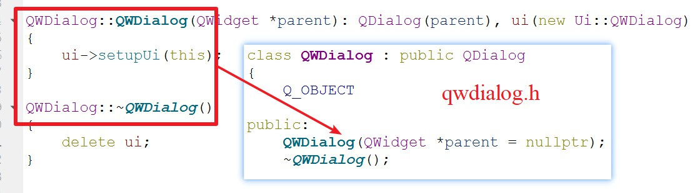
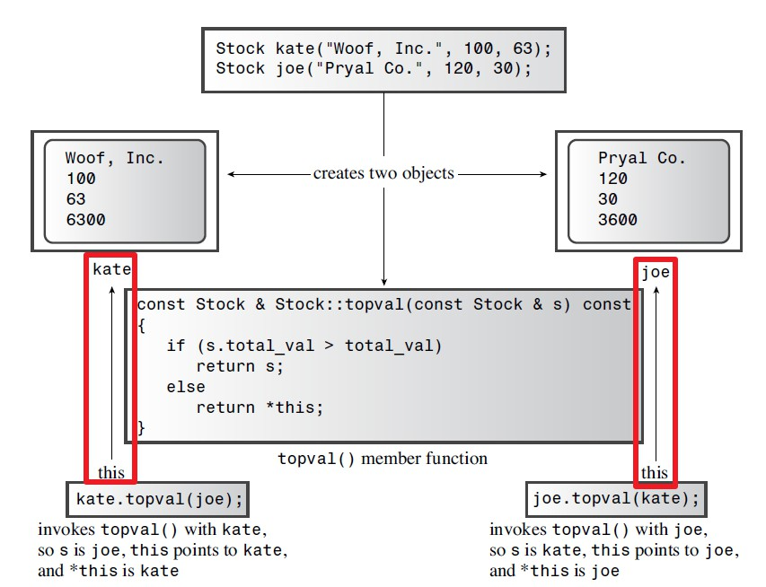
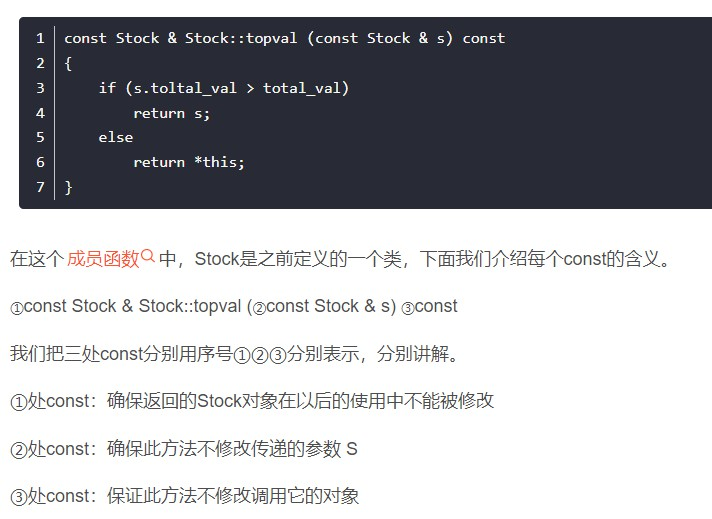

# C++学习笔记
## 对象和类
- 构造函数和析构函数在编译器编译过程中就已经创建，在释放前会自动调用析构函数。
- 构造函数与析构函数的执行顺序
     - 对于有多个构造函数的类
```C++
class Person {
public:
	//无参（默认）构造函数
	Person() {
		cout << "无参构造函数!" << endl;
	}
	//有参构造函数
	Person(int a) {
		age = a;
		cout << "有参构造函数!" << endl;
	}
	//拷贝构造函数
	Person(const Person& p) {
		age = p.age;
		cout << "拷贝构造函数!" << endl;
	}
	//析构函数
	~Person() {
		cout << "析构函数!" << endl;
	}
public:
	int age;
};
```
     - 当一个函数中，使用该类创建了多个对象时，需要所有对象执行完构造函数后才调用析构函数
```C++
void test02() {

	//2.1  括号法，常用
	Person p1(10);
	//注意1：调用无参构造函数不能加括号，如果加了编译器认为这是一个函数声明
	//Person p2();

	//2.2 显式法
	Person p2 = Person(10);
	Person p3 = Person(p2);
	//Person(10)单独写就是匿名对象  当前行结束之后，马上析构

	//2.3 隐式转换法
	Person p4 = 10; // Person p4 = Person(10); 
	Person p5 = p4; // Person p5 = Person(p4); 

	//注意2：不能利用 拷贝构造函数 初始化匿名对象 编译器认为是对象声明
	//Person p5(p4);
}
 ```
     
     构造函数将被调用，并且在被同一个函数调用结束后，才会按顺序依次调用析构函数。

- Date hiding is a good practice in computing because it preserves the integrity of the data.

### Constructor Initializer List




https://blog.csdn.net/zx3517288/article/details/48806785


### Knowing Your Objects: The `this` Pointer 
- WHAT：什么是`this`指针？
`this`指针是指向调用成员函数的对象的指针

     - 若kate调用topval()，this指向kate
     - 若joe调用topval()，this指向joe

- WHY:为什么需要`this`指针？
当利用一个类创建了多个对象时，且多个对象之间需要相互调用。此时作为参数被传入的对象拥有形参名，称为被显式地访问，另一个调用方法的对象被称为隐式的访问。对于这个调用方法的对象在方法内部实现过程中没有名字，通过`this`来指向。实际上，`this`被作为隐藏参数传递给了方法。
- HOW:如何使用`this`指针？
在


```C++
#include <iostream>
using namespace std;
#include <string>

class Stock
{
private:
	std::string company;
	int shares;
	double share_val;
	double total_val;
	void set_tot() { total_val = shares * share_val; }
public:
	Stock(); // default constructor
	Stock(const std::string & co, long n = 0, double pr = 0.0);
	~Stock(); // do-nothing destructor
	void buy(long num, double price);
	void sell(long num, double price);
	void update(double price);
	void show()const;
	const Stock & topval(const Stock & s) const;
};

// constructors
Stock::Stock()        // default constructor
{
	shares = 0;
	share_val = 0.0;
	total_val = 0.0;
}

Stock::Stock(const std::string & co, long n, double pr)
{
	company = co;
	if (n < 0)
	{
		std::cout << "Number of shares can't be negative; "
			<< company << " shares set to 0.\n";
		shares = 0;
	}
	else
		shares = n;
	share_val = pr;
	set_tot();
}

// class destructor
Stock::~Stock()        // quiet class destructor
{
}


// other methods
void Stock::buy(long num, double price)
{
	if (num < 0)
	{
		std::cout << "Number of shares purchased can't be negative. "
			<< "Transaction is aborted.\n";
	}
	else
	{
		shares += num;
		share_val = price;
		set_tot();
	}
}

void Stock::sell(long num, double price)
{
	using std::cout;
	if (num < 0)
	{
		cout << "Number of shares sold can't be negative. "
			<< "Transaction is aborted.\n";
	}
	else if (num > shares)
	{
		cout << "You can't sell more than you have! "
			<< "Transaction is aborted.\n";
	}
	else
	{
		shares -= num;
		share_val = price;
		set_tot();
	}
}

void Stock::update(double price)
{
	share_val = price;
	set_tot();
}

void Stock::show() const
{
	using std::cout;
	using std::ios_base;
	// set format to #.###
	ios_base::fmtflags orig =
		cout.setf(ios_base::fixed, ios_base::floatfield);
	std::streamsize prec = cout.precision(3);

	cout << "Company: " << company
		<< "  Shares: " << shares << '\n';
	cout << "  Share Price: $" << share_val;
	// set format to #.##
	cout.precision(2);
	cout << "  Total Worth: $" << total_val << '\n';

	// restore original format
	cout.setf(orig, ios_base::floatfield);
	cout.precision(prec);
}

const Stock & Stock::topval(const Stock & s) const
{
	if (s.total_val > total_val)
		return s;
	else
		return *this;
}

int main() {

	Stock kate("Woof, Inc.", 100, 63);
	Stock joe("Pryal Co.", 120, 30);
	kate.topval(joe).show();

	system("pause");

	return 0;
}

```

- 三个const的含义



常见错误：
- 不能在成员函数的类外部重新声明该函数
在成员函数的类外部是可以定义成员函数的，前提是该成员函数在类中已经被声明过了。因而这个错误类型往往有两种可能。
     - 在成员函数类外定义成员函数时()后加入了分号
     - 在main()函数中定义成员函数


## 名称空间(namespace)
C++中的名称包括变量、函数、结构、类等等。不同厂商的类库可能取了相同的名字，为了防止调用过程中产生冲突，利用名称空间来控制名称的作用域。

**Terms:**
- 声明区域（declaration region）: A declarative region is a region
in which declarations can be made.
- 潜在作用域（potential scope）：The potential scope for a variable
begins at its point of declaration and extends to the end of its declarative region.
- 作用域（scope）: The portion of the program that can actually see the variable is termed the scope.

### 名称空间的使用
- using Declarations
```C++
using Jill::fetch;
```
A using declaration, then, makes a single name available.

- using Dirctives
```C++
using namespace Jill;
```
This makes all the names in the namespace available.

### using Declarations VS using Dirctives
- Generally speaking, the using declaration is safer to use than a using directive because it shows exactly what names you are making available. And if the name conflicts with a local name, the compiler lets you know.
- 

## REFERENCES
- *C++ primer plus*, Stephen Prata, Sixth Edition.
